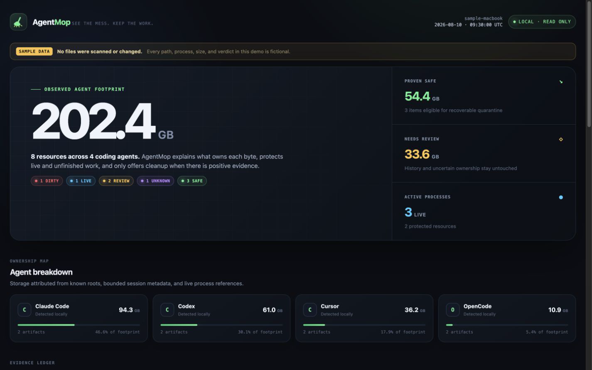

<div align="center">
  <a href="https://github.com/weivwang/agentmop">
    
  </a>

  <h1>AgentMop</h1>

  <p><strong>Your coding agents are done. Their 202 GB isn’t.</strong></p>
  <p><code>ncdu + lsof + git doctor</code> for AI coding agents.</p>

  <p>
    <a href="https://github.com/weivwang/agentmop/actions/workflows/ci.yml"></a>
    <a href="https://github.com/weivwang/agentmop/releases"></a>
    <a href="LICENSE"></a>
    
    
  </p>

  <p>
    <a href="https://weivwang.github.io/agentmop/">Live demo</a> ·
    English · <a href="README.zh-CN.md">简体中文</a> ·
    <a href="docs/WHY.md">Why AgentMop?</a> ·
    <a href="CONTRIBUTING.md">Contributing</a>
  </p>
</div>



AI coding agents leave more than code behind: linked worktrees, full repository copies, caches, logs, resumable sessions, and processes that outlive their parent. One public Codex report found [118 run copies consuming 202 GB](https://github.com/openai/codex/issues/35383); another measured [about 755 GiB of session JSONL](https://github.com/openai/codex/issues/34061). A third documented [orphaned `app-server` processes with `PPID=1`](https://github.com/openai/codex/issues/11090).

AgentMop turns that pile into an explainable inventory for **Codex, Claude Code, Cursor, and OpenCode**. It measures known local storage, observes matching processes, checks Git state, records ownership evidence, and assigns one of five deliberately conservative verdicts: `LIVE`, `DIRTY`, `SAFE`, `REVIEW`, or `UNKNOWN`.

The default command is read-only. AgentMop has no telemetry, account, API key, model, or third-party npm runtime dependency. Optional cleanup is limited to freshly rescanned, cleanup-eligible `SAFE` artifacts and is recoverable until you explicitly purge it.

## Run it in 30 seconds

You need Node.js 20 or newer and Git on `PATH`.

```bash
npx github:weivwang/agentmop
```

The npm package has **not been published yet**, so the GitHub package spec is the current install-free path. After the first npm release, the shorter command will be:

```bash
npx agentmop
```

Want to see the complete report without scanning your machine?

```bash
npx github:weivwang/agentmop demo --no-open
```

`demo` writes a self-contained HTML report and prints a deterministic terminal dashboard. Every path, size, process, and verdict in demo mode is visibly marked as fictional sample data.

<details>
<summary><strong>Actual v0.1.0 demo output excerpt</strong> (sample data; long paths and the middle breakdown are abbreviated here)</summary>

```text
╭──────────────────────────────────────────────────────────────────────────────╮
  AGENTMOP  Agent workspace hygiene report
  See the mess. Keep the work. · 2026-08-10T09:30:00Z
  ◆ SAMPLE DATA — no files were scanned or changed
╰──────────────────────────────────────────────────────────────────────────────╯

OVERVIEW
  202.4 GB observed  ·  54.4 GB proven safe  ·  33.6 GB needs review
  8 artifacts  ·  3 live agent processes  ·  read-only scan

STATUS LEGEND
  [DIRTY] uncommitted work    [LIVE] actively owned    [REVIEW] decide manually
  [UNKNOWN] proof incomplete    [SAFE] positive evidence; eligible for quarantine

ARTIFACTS · HIGHEST RISK FIRST
  RISK       AGENT       RESOURCE          SIZE AGE        LOCATION
  [DIRTY]    Claude Code worktree       71.6 GB today      ~/.claude/worktrees/checkout-api-v2
  [LIVE]     Codex       worktree       42.8 GB today      ~/.codex/worktrees/desktop-sync
  [REVIEW]   Claude Code history        22.7 GB 1 month    ~/.claude/projects
  [UNKNOWN]  OpenCode    temp            8.9 GB 1 month    ~/.local/share/opencode/tmp
  [SAFE]     Cursor      cache          31.4 GB 3 months   ~/.cursor/cache

NEXT STEPS
  Preview only     agentmop clean --safe --dry-run
  Quarantine safe  agentmop clean --safe
  Visual report    agentmop scan --html agentmop-report.html
```

</details>

## What it finds

AgentMop v0.1.0 scans a small, explicit set of agent-owned roots. Missing paths are ignored; it does not guess across your entire home directory.

| Agent | Storage inspected | Worktree roots |
| --- | --- | --- |
| Codex | `~/.codex/sessions`, `archived_sessions`, history, logs, cache, `tmp`, and `.tmp` data | `~/.codex/worktrees` |
| Claude Code | `~/.claude/projects`, history, file history, shell/session state, todos, logs, cache, and temp data | `~/.claude/worktrees` |
| Cursor | `~/.cursor/projects`, chats, history, logs, cache, cached data, and temp data | `~/.cursor/worktrees` |
| OpenCode | storage, snapshots, logs, cache, and temp data below `~/.local/share/opencode` plus config cache | OpenCode `worktree` / `worktrees` data roots |

It also inspects:

- direct children of the system temp directory by default, plus one or more exact roots added with repeatable `--tmp-root` options;
- agent-looking temp names for review, and temp locations positively associated by bounded session metadata;
- registered linked Git worktrees found below known agent roots;
- matching Codex, Claude Code, Cursor, and OpenCode processes, using sanitized commands and path references.

No temp-directory basename—including `codex-*`, `claude-*`, `cursor-*`, or `opencode-*`—proves ownership by itself or can authorize `SAFE`. Without stronger evidence, a name-only candidate falls back to `REVIEW`; protective evidence can instead make it `LIVE`, `DIRTY`, or `UNKNOWN`. Generic names such as `project-*`, `repo-*`, and `workspace-*` never gain cleanup ownership from a session reference alone. Process inspection is observational: AgentMop does not terminate processes.

A temporary path containing a standalone or bare Git repository is also never automatically cleaned: dirty worktrees are `DIRTY`, active references are `LIVE`, while clean unreferenced and bare repositories are `REVIEW` because they may contain unique local commits or refs. Only registered linked worktrees enter the stricter worktree safety path.

## How it works

```text
known agent roots ─┐
temp roots ────────┼─> lstat inventory ─┐
bounded metadata ──┤                    ├─> evidence classifier ─> terminal / HTML / JSON
process table ─────┤                    │                            │
Git worktrees ─────┘                    └────────────────────────────┴─> fresh SAFE plan
                                                                          │
                                                       quarantine <─ restore / purge
```

1. **Discover narrowly.** Adapters enumerate known locations. Temp scanning is limited to direct children of explicit temp roots, and worktree discovery has a depth bound.
2. **Observe without following links.** Filesystem traversal uses `lstat`; every candidate component below its trusted HOME or temp-root boundary is checked without following symlinks. Where block counts are available, the footprint uses allocated bytes (`st_blocks × 512`) and retains logical bytes as metadata, so sparse JSONL is not presented as fully allocated. Session readers inspect only a bounded JSONL prefix and return constrained identifiers plus absolute working directories—not prompt, message, tool-output, or source-content fields.
3. **Correlate evidence.** Agent paths, session working-directory references, process paths, Git registration, branch/HEAD state, modification age, and inspection errors are kept in the report.
4. **Fail closed.** Classification is deterministic. Missing process evidence, incomplete filesystem access, weak ownership, or ambiguous Git state blocks `SAFE`.
5. **Render locally.** Terminal and JSON output stay on stdout; `--html` writes one self-contained file with no external scripts, styles, or network requests.
6. **Mutate only on request.** `clean --safe` performs a new scan, selects only cleanup-eligible `SAFE` artifacts, revalidates them, and then records a recoverable batch.

### The five verdicts

| Verdict | Meaning | Cleanup |
| --- | --- | --- |
| `DIRTY` | Git reports modified or untracked work. This takes priority for worktrees so unfinished changes remain visible. | Never eligible |
| `LIVE` | A running agent process references the path. | Never eligible |
| `SAFE` | Positive agent ownership, sufficient staleness, a successful process check with no matching reference, and an implemented cleanup strategy are all present. Linked worktrees must also be clean, registered, and have a preserved branch and HEAD. | Eligible for a fresh cleanup plan |
| `REVIEW` | The data may matter, is too new, has weak ownership evidence, or was scanned without process evidence. | Never selected automatically |
| `UNKNOWN` | Inspection or identity evidence is incomplete—for example, a non-history symlink, unreadable non-history path, or unresolved Git identity. Session/history policy takes precedence and keeps those stores in `REVIEW`. | Never eligible |

**Sessions and history are never `SAFE`, no matter how old or large they are.** Deleting session JSONL can break resume/history workflows; [the 755 GiB incident report makes that cost explicit](https://github.com/openai/codex/issues/34061). AgentMop inventories that data as `REVIEW` so you can see the footprint without turning age into permission to erase it.

## Safety model

`SAFE` means “the implemented evidence policy allows this cleanup strategy,” not “this data has no conceivable value.” Review every plan and keep backups of important work.

### Scan boundary

- `agentmop` and `agentmop scan` never modify scanned agent resources; `--html` only writes the report file you request.
- `--no-processes` is allowed for inventory, but deliberately prevents any artifact from becoming `SAFE`.
- A failed process-table probe prevents every `SAFE` verdict. If a matched process's working directory cannot be observed, `SAFE` is disabled for that agent.
- Candidate symlinks and symlinked path ancestors are never followed or cleaned.
- Report files can contain local paths, repository names, and sanitized commands; inspect them before sharing.

### Cleanup boundary

- `clean` refuses to run without `--safe` and performs its own new scan.
- The mutation layer accepts only `SAFE` **and** cleanup-eligible artifacts from a report generated within five minutes.
- A caller-supplied cleanup `HOME` must match the scan report's `HOME`; mismatched cleanup contexts fail before any batch or artifact is changed.
- Exact `--id` filters fail if an id is absent, no longer safe, or not cleanup-eligible.
- Broad roots, unsupported artifact types, changed or missing snapshots, and symbolic-link path components are independently rejected.
- Every item gets a fresh process-reference check across all supported agents immediately before mutation; incomplete cwd evidence at this point stops cleanup. A clean linked worktree also gets a second Git status and HEAD check.
- Cache and temp data are renamed into `~/.agentmop/quarantine/<batch-id>/`. Linked worktrees use `git worktree move` into the same private batch rather than being removed.
- Moving the whole worktree preserves its ignored local files as well as tracked content. The original path, repository, branch, HEAD, filesystem identity, and completed operation are recorded in the private manifest.
- Before each mutation, the original→quarantine mapping is atomically recorded. This keeps an interrupted post-move operation recoverable; caught failures also stop later operations and record a partial result. It is not a power-loss durability guarantee.

### Restore and purge boundary

- `restore <batch-id>` replays a batch in reverse and refuses to overwrite a path that has since been recreated. For worktrees it verifies the quarantined HEAD and repository, then moves the same complete worktree back.
- `quarantine list` shows recoverable and partial batches.
- `purge <batch-id> --yes` is the separate, permanent step. Each deletion is pre-recorded; a later failure produces `purge-partial`. Restore moves back any remnants, but returns `restore-partial` whenever a purge started without confirmed completion because missing content cannot be ruled out.
- Partial cleanup, restore, and purge outcomes return a non-zero CLI exit code so automation cannot mistake them for success.

Start with a dry run:

```bash
npx github:weivwang/agentmop clean --safe --dry-run
```

## CLI

| Command | What it does |
| --- | --- |
| `agentmop` / `agentmop scan` | Read-only scan and terminal report |
| `agentmop scan --json` | Machine-readable report |
| `agentmop scan --html report.html --no-open` | Self-contained visual report without opening a browser |
| `agentmop scan --deep` | Search more bounded session metadata files and deeper known worktree roots |
| `agentmop scan --older-than 14d` | Change the staleness threshold (`m`, `h`, `d`, or `w`) |
| `agentmop scan --tmp-root /path` | Add an exact temp root alongside the system default; repeat to add several roots |
| `agentmop scan --no-processes` | Skip process observation; no artifact can become `SAFE` |
| `agentmop clean --safe --dry-run` | Fresh scan and preview of eligible `SAFE` items |
| `agentmop clean --safe [--id ID]` | Quarantine all eligible items, or repeat exact ids to narrow the plan |
| `agentmop quarantine list` | List cleanup batches and their states |
| `agentmop restore BATCH_ID` | Restore a recoverable batch |
| `agentmop purge BATCH_ID --yes` | Permanently remove quarantined payloads |
| `agentmop demo --no-open` | Render the deterministic, clearly labelled sample report |

Interactive cleanup asks you to type a plan-derived confirmation token. In scripts or CI, use `--dry-run`; use `--yes` only after reviewing the exact plan.

## Support matrix

### Agent adapters

| Capability | Codex | Claude Code | Cursor | OpenCode |
| --- | :---: | :---: | :---: | :---: |
| Known home-data inventory | ✅ | ✅ | ✅ | ✅ |
| Session/history visibility (`REVIEW` only) | ✅ | ✅ | ✅ | ✅ |
| Cache/log/temp inventory | ✅ | ✅ | ✅ | ✅ |
| Known linked-worktree discovery | ✅ | ✅ | ✅ | ✅ |
| Matching process observation | ✅ | ✅ | ✅ | ✅ |

Storage layouts change between agent releases. This table means the explicit v0.1.0 roots listed above are implemented; it does not mean every desktop-app cache or third-party extension directory is already covered. Please [open an adapter request](https://github.com/weivwang/agentmop/issues/new?template=adapter.yml) with redacted paths when a current layout is missing.

### Platforms

| Platform | Current behavior |
| --- | --- |
| macOS | Filesystem, Git, and `ps`-based process observation, with a read-only `lsof` cwd query for each matched agent process. Absolute command-path references are also correlated when present. |
| Linux | Filesystem, Git, and `ps` observation, plus process working-directory evidence through `/proc/<pid>/cwd`. |
| Windows | Experimental filesystem/Git inventory. If the Unix-style process probe is unavailable, AgentMop warns and produces no `SAFE` verdicts. |

CI runs the dependency-free test suite on Node 20, 22, and 24 across Ubuntu, macOS, and Windows. Real storage fixtures and process semantics still vary by operating system, so a green CI badge is not a claim that every agent version has the same on-disk layout.

## How it compares

These projects solve adjacent parts of the same growing hygiene problem; they are often complementary.

| Project | Primary job | Evidence / decision model | Mutation model |
| --- | --- | --- | --- |
| **AgentMop** | Multi-agent storage, worktree, session, temp, and process inventory | Five fail-closed verdicts with per-item ownership and safety evidence | Fresh `SAFE` plan → recoverable file or whole-worktree quarantine → explicit restore or purge |
| [`cc-reaper`](https://github.com/theQuert/cc-reaper) | Diagnose and reap orphaned Claude/Codex-related process trees | Process ancestry, PGID, age/CPU/FD rules, and protected patterns | Process signals; includes dry-run/monitoring paths but intentionally focuses on live system resources |
| [`agent-worktree-janitor`](https://github.com/yanqr213/agent-worktree-janitor) | Offline workspace cleanup plans and CI hygiene gates | Parses workspace and Git text into risk-scored reports | Never deletes; emits commented Bash/PowerShell plans for human review |
| [`disk-janitor`](https://github.com/WillieCubed/disk-janitor) | Prevent duplicate Cargo/pnpm build data and schedule stale build/worktree cleanup | Configured project roots and age thresholds, with dry-run support | Direct or scheduled cleanup of regenerable build artifacts and abandoned worktrees |
| [`AgentHub`](https://github.com/jamesrochabrun/AgentHub) | Native macOS UI for running and monitoring Claude Code/Codex sessions | Session ownership and app-managed worktree context | Interactive worktree/session management inside a broader agent workspace |

AgentMop's narrow thesis is that **storage should not be deleted until the tool can explain who owns it, why it is not live, and how to get it back**. It intentionally does not kill processes, rewrite agent configuration, schedule background deletion, or treat old session history as garbage.

## Roadmap

- [x] Read-only scanner for Codex, Claude Code, Cursor, and OpenCode
- [x] Evidence-backed five-state classification
- [x] Terminal, JSON, and self-contained HTML reports
- [x] Fresh-scan cleanup, quarantine batches, restore, and explicit purge
- [ ] Publish `agentmop` to npm and attach verified release artifacts
- [ ] Expand current agent layouts with redacted real-world fixtures, especially desktop-app caches
- [ ] Add more process-ownership evidence on platforms without `/proc`
- [ ] Add adapters for more coding agents through the same fail-closed contract
- [ ] Stabilize a versioned JSON schema for policy and fleet tooling

The roadmap is directional, not a promise of dates. Safety regressions take priority over adding more deletion targets.

## Development and contributing

AgentMop uses only the Node.js standard library at runtime.

```bash
git clone https://github.com/weivwang/agentmop.git
cd agentmop
npm install
npm run check
npm test
node bin/agentmop.js demo --html /tmp/agentmop-demo.html --no-open
```

New adapters must use isolated fixture homes, read bounded metadata, avoid prompt/source content, never follow symlinks, keep session/history data out of `SAFE`, and include human-verifiable reasons. Read the full [contribution guide](CONTRIBUTING.md), [architecture](docs/ARCHITECTURE.md), and [security policy](SECURITY.md) before changing cleanup behavior.

## License

[MIT](LICENSE) © weiwei Wang
